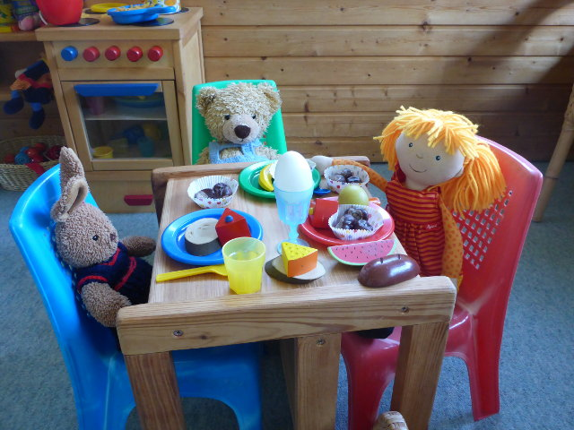
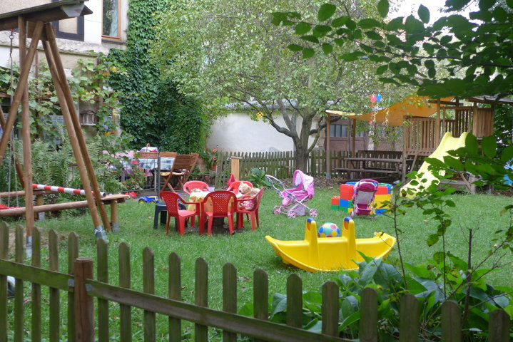
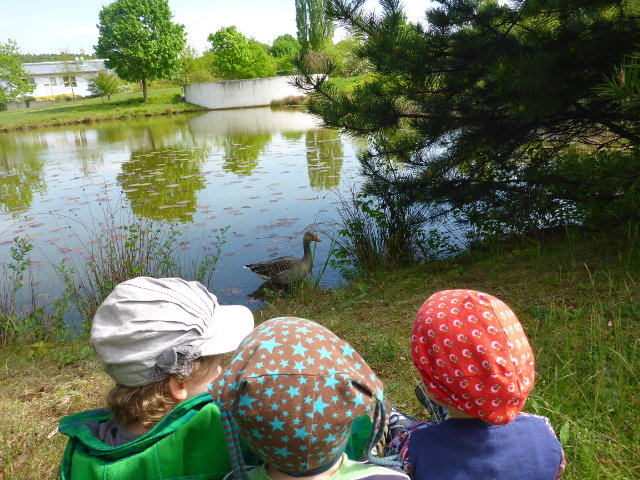

## Herzlich willkommen!

  
  
  

Liebe Eltern,

ich biete Ihnen liebevolle Ganztagsbetreuung für Ihr Kind. Als Tagesmutter bin ich mit sehr viel Freude an meinem Beruf und langjähriger Erfahrung unterwegs. Wir spielen, malen, singen und kneten auch mit Ton.

Es steht ein selbst genutztes Einfamilienhaus mit naturnahem Garten zur Verfügung, in dem die Kinder ihre Bedürfnisse nach Bewegung, Erkundung und neuen Sinneseindrücken ausleben können. Regelmäßig treffen wir uns mit Tagesmüttern und ihren Tageskindern im näheren Umfeld. Wir gehen täglich an die frische Luft, oft auch in den Wald und essen vollwertig, natürlich selbst zubereitet. 

Miteinander in Beziehung sein und jeden Tag ein Stück über sich hinauswachsen, das lieben wir am meisten. Wichtig sind mir auch eine ehrliche Kommunikation mit den Eltern und gute zwischenmenschliche Beziehungen auf Augenhöhe. 

## Unser Tagesablauf

0800 | Ankunft, Morgenkreis: Singen mit Gitarre, Angebot oder Freispiel 
0830 | Frühstück 
0900 | Anziehen und Rausgehen (z. B. in den Garten, in den Wald und in die weite Welt)
1100 | Freispiel, Angebote und Mittagessen zubereiten 
1130 | Mittagessen 
1200 | Vorbereitung zum Mittagsschlaf, Vorlesen, Singen, Fingerspiele 
1230 | Schlafzeit 
1500 | Nachmittagsmahlzeit 
1530 | Aufräumen, Anziehen, Rausgehen, Verabschiedung der Kinder: Schlusslied singen
1600 | Abholen

Vereinbaren Sie mit mir einen Termin für einen Besuch in der Villa Mimi.
